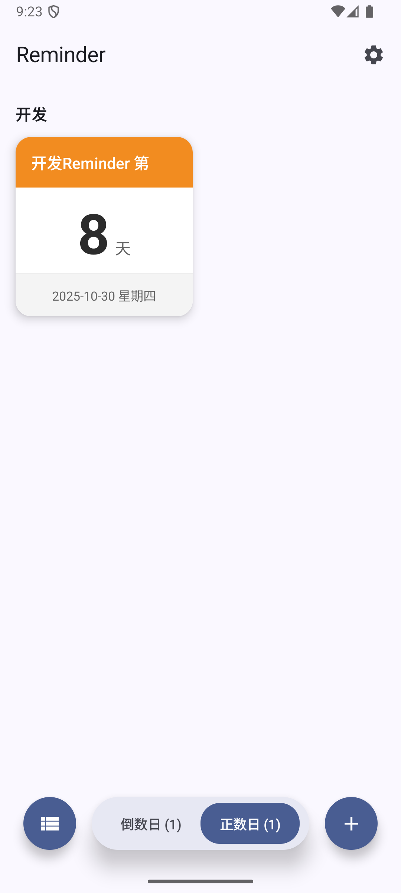
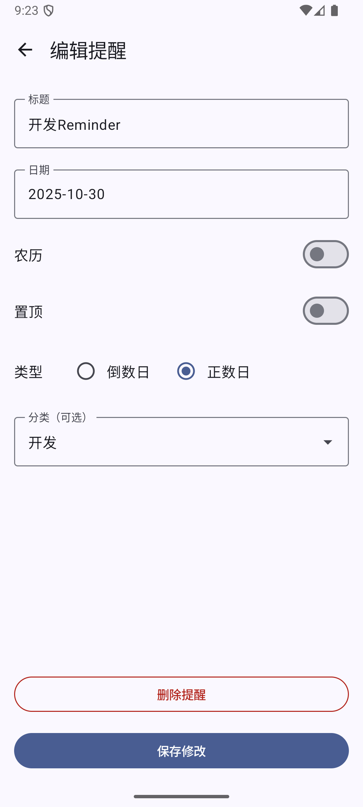
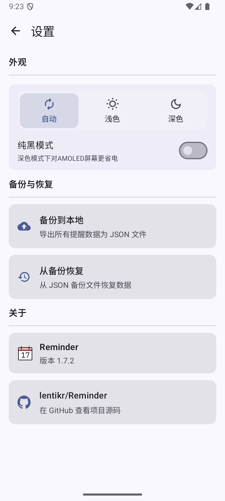
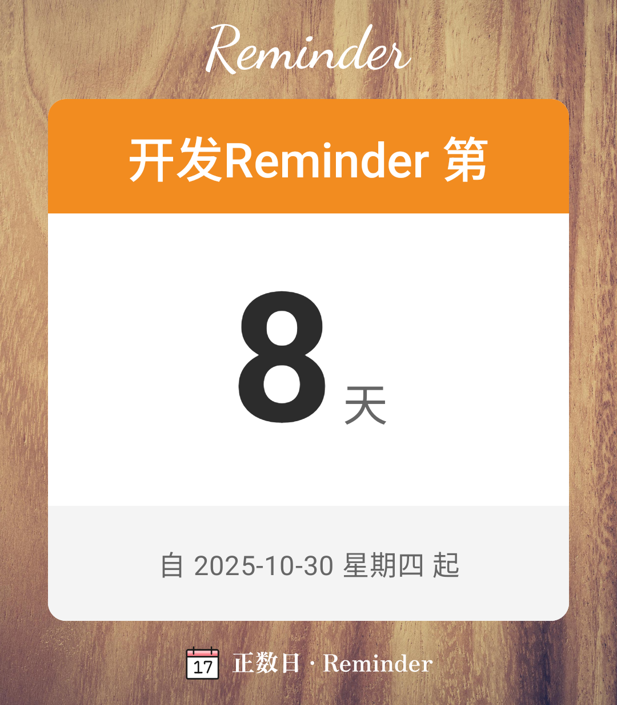

# Reminder

Reminder 是一款简洁的安卓纪念日/倒数日管理应用，支持倒数与正数两种模式，帮助你轻松掌握重要日期。应用完全使用 Jetpack Compose 构建。

## 主要功能

- **倒数日与正数日**

  - 倒数日：用来提醒生日、纪念日等未来事件。
  - 正数日：记录人生中值得纪念的天数，比如“来到世界的第 N 天”。
  - 支持农历，并可选自动换算下一个农历日期。

- **分组与置顶**

  - 可以为每个提醒设置分类，快速整理不同场景的事件。
  - 重要提醒可以置顶显示，随时掌握最新状态。

- **重复周期**

  - 支持设置重复周期（x天、x周、x月、x年）

- **分享与导出图片**

  - 允许用户以图片形式保存或分享纪念日

- **外观设置**

  - 自动 / 浅色 / 深色三种主题模式可选。
  - 深色模式下可启用纯黑主题，适配 AMOLED 屏幕更省电。
  - UI 采用卡片化布局，同时支持列表模式，满足不同浏览习惯。

- **数据备份与恢复**

  - 内置备份功能，一键导出到 JSON 文件，保留所有提醒信息。
  - 支持从 JSON 备份中恢复，换机或重装也能快速同步数据。

## 界面预览

  
  
  

## 反馈与贡献

欢迎在 Issues 中提交 bug 反馈或功能建议，也欢迎直接提交 Pull Request 参与改进。如果这个项目对你有帮助，别忘了点个 Star 支持一下。
